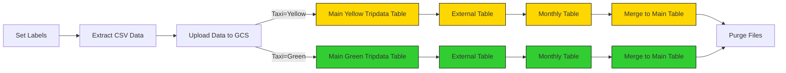

## Lesson 2: Workflow Orchestration

Kestra 

is an open-source, infinitely-scalable orchestration platform that enables all engineers to manage business-critical workflows.

We create `docker-compose.yml` file. 

- Question: Kestra and postgres using same image but we are creating separate database for each inside the same image?

You are using the same Docker image (postgres:18), but you are not sharing one Postgres instance or one database. You are running two completely separate Postgres containers, each with its own data volume and its own database(s).


A Docker image is just a blueprint.
A Docker container is a running instance of that blueprint.

You use the same blueprint twice:

```
pgdatabase:
  image: postgres:18

kestra_postgres:
  image: postgres:18

```

This means:

Same Postgres version

Same base configuration

Same binaries

But once containers start, they live separate lives.


We'll set up Kestra using Docker Compose containing one container for the Kestra server and another for the Postgres database:


```
cd 02-workflow-orchestration
docker compose up -d
```

Note: Check that pgAdmin isn't running on the same ports as Kestra. If so, check out the FAQ at the bottom of the README.

Once the container starts, you can access the Kestra UI at http://localhost:8080.


-d stands for detached mode.

- Containers start in the background
- Terminal is immediately free
- Containers keep running even if you close the terminal
- No logs shown automatically. without -d Logs stream directly into your terminal


To shut down Kestra, go to the same directory and run the following command:

`docker compose down`


### 2.2.2 - Kestra Concepts

Flow (workflow)
 └─ Tasks
     └─ Task Runner


Workflow consists of tasks. Tasks has properties. We can pass data between tasks using outputs.

Workflow cannot be edited after we press SAVE. 


Question: task runner

taskRunner answers one specific question: Where and how should this task actually run? in what execution environment.

- input - we can click Exeecute and fill input 

We can use input as expression: 

`{{inputs.name}}`

- We can pass input to a variable 

`{{render(vars.welcome_message)}}`

This renders input first => then variable

- outputs: Return task


use output:
`{{outputs.generate_output.value}}`

- triggers: task Schedule (can be event too)

- concurrency: how many of such workflows can run at the same time


### 2.3.2 Pipeline: Load Taxi Data to Postgres

We use NY Taxi data 2019-2021:
https://github.com/DataTalksClub/nyc-tlc-data/releases


`04_postgres_taxi.yaml`

- inputs:
We add three inputs: taxi type (yellow or green), year, month. We store yellow and green taxi data into separate tables. 


- variables:

=> We ask user to fill input
=> Based on input we create variable
=> Based on variable we create labels

- extract task:

we use wget to download files from GitHub

taskRunner: defines where to run the task

Runs the task as a local process on the Kestra machine.

```
taskRunner:
  type: io.kestra.plugin.core.runner.Process
```


- postgresql task:

=> create_table
=> create_staging_table
=> truncate_staging_table 
=> copy_in_to_staging_table
=> add_unique_id_and_filename
=> merge a table with staging table 


- Question: 

I just executed it for 2019 January green_trip data. what if I excute again, new data will be appended or existing data overwritten?

No, its not overwritten. We generate unique_row_key based on column values. Next time we generate this unique_row_key based on same column values, it will be the same. so when we reach INSERT, since new generated unique_row_key and unique_row_key in the table is the same, INSERT is not executed. INSERT is executed only when new generated unique_row_key and existing unique_row_key in the table does not MATCH 


```sql
MERGE INTO target T
USING staging S
ON T.unique_row_id = S.unique_row_id
WHEN NOT MATCHED THEN
  INSERT ...

```

Note: after workflow is edited, dont forget to click Save button

after extract task U added the following task to check the size of the file for Question 1:


```yml
  - id: check_file_size
    type: io.kestra.plugin.scripts.shell.Commands
    taskRunner:
      type: io.kestra.plugin.core.runner.Process
    commands:
      - ls -lh {{render(vars.file)}}
```

Thoughts about Kestra:
- I liked Gantt view - horizontal Execute view of Kestra. It is more user-friendly than Airflows vertical bars. 
- Kestra needs Stop button to interrupt workflow mannually. 
- I dont like to embed Python code into YML markdown file 


### 2.3.3 Scheduling and Backfills

We create flow with trigger. Then define schedule when this will trigger: 


```yml
variables:
  file: "{{inputs.taxi}}_tripdata_{{trigger.date | date('yyyy-MM')}}.csv"
  staging_table: "public.{{inputs.taxi}}_tripdata_staging"
  table: "public.{{inputs.taxi}}_tripdata"
  data: "{{outputs.extract.outputFiles[inputs.taxi ~ '_tripdata_' ~ (trigger.date | date('yyyy-MM')) ~ '.csv']}}"

triggers:
  - id: green_schedule
    type: io.kestra.plugin.core.trigger.Schedule
    cron: "0 9 1 * *"
    inputs:
      taxi: green

  - id: yellow_schedule
    type: io.kestra.plugin.core.trigger.Schedule
    cron: "0 10 1 * *"
    inputs:
      taxi: yellow
```

Now we can use this trigger for backfill. Backfil is going to previous time when this schedule would have run and fetching data for that previous date. 


### 2.4.2 ELT Pipelines in Kestra: Google Cloud Platform

Now that you've learned how to build ETL pipelines locally using Postgres, we are ready to move to the cloud. In this section, we'll load the same Yellow and Green Taxi data to Google Cloud Platform (GCP) using: 
1. Google Cloud Storage (GCS) as a data lake  
2. BigQuery as a data warehouse.


### 2.4.1 - ETL vs ELT

In 2.3, we made a ETL pipeline inside of Kestra:
- **Extract:** Firstly, we extract the dataset from GitHub
- **Transform:** Next, we transform it with Python
- **Load:** Finally, we load it into our Postgres database

While this is very standard across the industry, sometimes it makes sense to change the order when working with the cloud. If you're working with a large dataset, like the Yellow Taxi data, there can be benefits to extracting and loading straight into a data warehouse, and then performing transformations directly in the data warehouse. When working with BigQuery, we will use ELT:
- **Extract:** Firstly, we extract the dataset from GitHub
- **Load:** Next, we load this dataset (in this case, a csv file) into a data lake (Google Cloud Storage)
- **Transform:** Finally, we can create a table inside of our data warehouse (BigQuery) which uses the data from our data lake to perform our transformations.

The reason for loading into the data warehouse before transforming means we can utilize the cloud's performance benefits for transforming large datasets. What might take a lot longer for a local machine, can take a fraction of the time in the cloud.


- open GCP account 

- create new project in GCP 
  kestra-sandbox
  ID: infinite-sight-486200-b0

Key that allows Kestra to connect to GCP: 

- IAM > Service Account
  name: de-zoomcamp-2026
  role: Owner
  Keys > Add key > JSON 


- Load key JSON file to Kestra
  create environment variable inside Docker compose


echo -n "myCode" | base64 
=> cd1234 

docker-compose: 
```
kestra:
  environment:
    SECRET_MYSECRET: cd1234
```

flow:
`{{secret('MY_SECRET)}}`


- add json to flow 06_gcp_kv and execute it

Kestra now has all GCP configuration stored internally.

- execute flow 07_gcp_setup.yaml 

Kestra authenticates using GCP_CREDS

Creates:

  GCS bucket + BigQuery dataset

  Skips creation if they already exist


Cloud Storage => Buckets

BigQuery => Explorer => Datasets


### 2.4.3   GCP Workflow: Load Taxi Data to BigQuery

Now that Google Cloud is set up with a storage bucket, we can start the ELT process.

The steps are similar to loading data to Postgres DB. But this time we load CSV file to Data Lake - GCP Bucket. Then we load CSV data to DWH - BigQuery. 

`08_gcp_taxi.yaml`





For a chosen taxi type, year, and month the flow does the following:

Downloads NYC taxi data (CSV)
Uploads it to Google Cloud Storage (upload_to_gcs)
Creates BigQuery tables if needed
Loads data via an external table
Deduplicates and merges into a final partitioned table
Cleans up temporary files

Same pipeline, two branches: Yellow taxi & Green taxi 


Trigger

We can now schedule the same pipeline shown above to run daily at 9 AM UTC for the green dataset and at 10 AM UTC for the yellow dataset. You can backfill historical data directly from the Kestra UI.

Since we now process data in a cloud environment with infinitely scalable storage and compute, we can backfill the entire dataset for both the yellow and green taxi data without the risk of running out of resources on our local machine.

The flow code: 09_gcp_taxi_scheduled.yaml.

